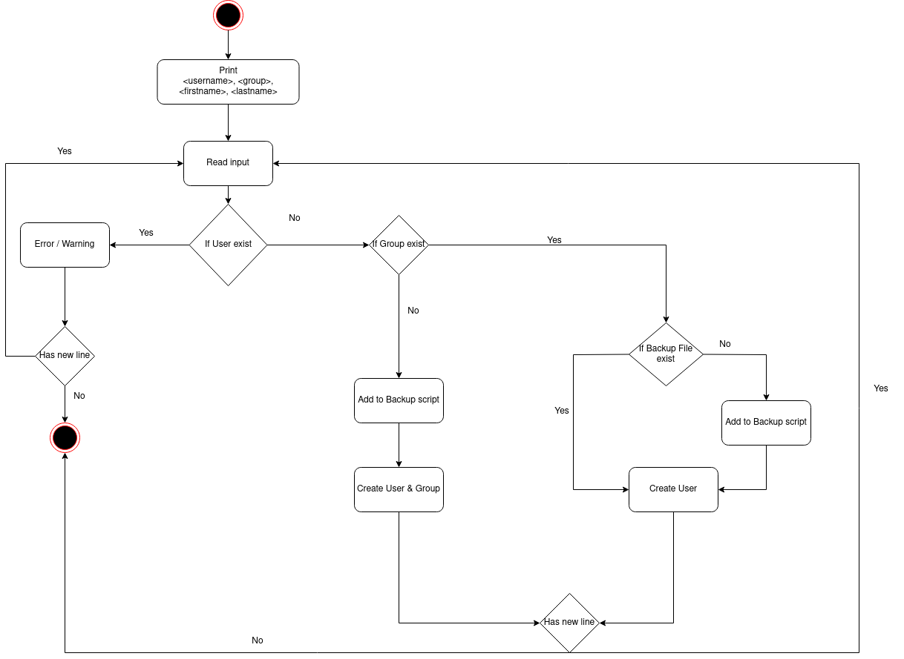
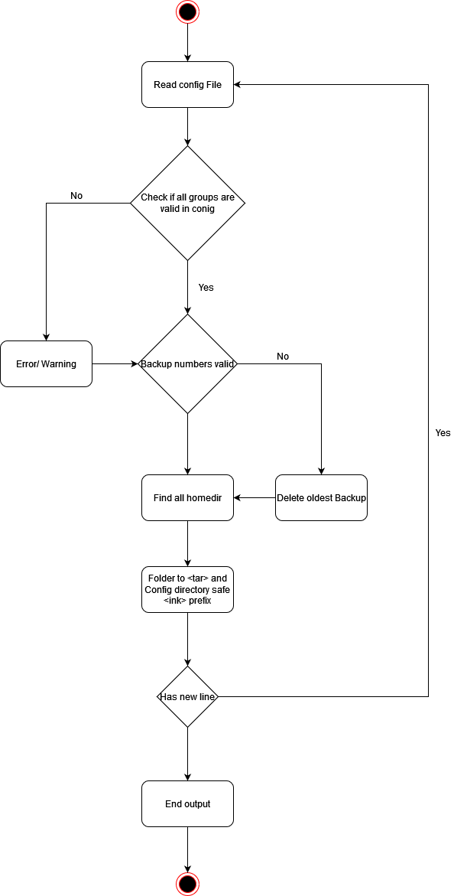

# Projekt Dokumentation

## Einleitung
In einer Firma möchte man ganz einfach neue Mitarbeiter auf einem System erfassen können. Dazu möchte der Unix-Verantwortliche ein Skript haben, welches aufgrund eines Files neue User erfasst und deren Unix-Umgebung (Home-Directory) einrichtet. Er möchte auch ein Backupskript, welches die Home-Directories der User sichert.

## Lösungsdesign
Nach dem analysieren des Auftrags, haben wir folgendes Lösungsdesign erstellt, welches wir anhand dieser zwei Activity Diagramme gelöst haben.

### Aufruf der Skripte

#### Script 1
```
cd &ltPfad&gt <br>
sudo bash User.sh
```

#### Script 2
```
cd &ltPfad&gt <br>
sudo bash backup.sh
```

### Ablauf der Automation

#### Script 1:


#### Beschreibung:
Dieses Activity Diagramm zeigt dem Kunden, wie man einen User erstellen kann.

#### Script 2:


#### Beschreibung:
Dieses Activity Diagramm zeigt dem Kunden, wie ein Backup File erstellt wird.

### Konfigurationsdateien

#### Script 1: 

Dies sind die benötigten Parameter, welche mitgegeben werden müssen. Sie werden verwendet, um ein User erstellen zu können.
```
<username> <groupname> <firstname lastname>
```

Im userConfig.conf kann das Defaultpasswort definiert werden: <br>
```
DEFAULT_PASSWORD=Modul122_2022
```

#### Script 2:

MAX_BACKUP  -> Limit der Backups<br>
EXCLUDE     -> Files und Ordner, die nicht gespeichert werden sollen<br>
BACKUP_DIR  -> Pfad in dem das Backupfile liegt<br>
PRAEFIX     -> BackupFile Prefix<br>

## Abgrenzungen zum Lösungsdesign

