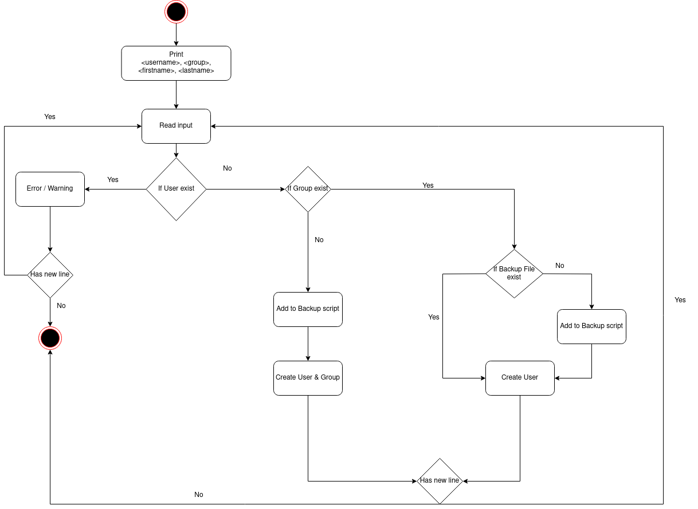

# Projekt Dokumentation

## Lösungsdesign
Nach dem analysieren des Auftrags, haben wir folgendes Lösungsdesign erstellt, welches wir anhand dieser zwei Activity Diagramme gelöst haben.

### Aufruf der Skripte

#### Script 1

##### Git Repository klonen
```
git clone https://github.com/EAlbanese/m122_praxisarbeit_Goudsmit_Albanese/
```

##### Script Ordner öffnen
```
cd <pfad>/Scripts
```

##### Script starten
```
bash Script1.sh
```

#### Script 2


##### Script Ordner öffnen
```
cd <pfad>/Scripts
```

##### Script starten
```
bash Script2.sh
```

### Ablauf der Automation

#### Script 1:


#### Beschreibung:
Dieses Activity Diagramm zeigt dem Kunden, wie man einen User erstellen kann.

#### Script 2:


#### Beschreibung:
Dieses Activity Diagramm zeigt dem Kunden, wie ein Backup File erstellt wird.

### Konfigurationsdateien

#### Script 1: 
```
<username> <groupname> <firstname lastname>
```
Dies sind die benötigten Parameter, welche mitgegeben werden müssen. Sie werden verwendet, um ein User erstellen zu können.

#### Script 2:
Config File<br>
BackupLimit -> Limit der Backups<br>
BackupPath  -> Pfad in dem das Backupfile liegt<br>
Gruppen     -> Array der Gruppen<br>
TarPrefix   -> BackupFile Prefix<br>

## Abgrenzungen zum Lösungsdesign

TODO: Nachdem das Programm verwirklicht wurde, hier die Unterschiede von der Implementation zum Lösungsdesign beschreiben (was wurde anders gemacht, was wurde nicht gemacht, was wurde zusaetzlich gemacht)
